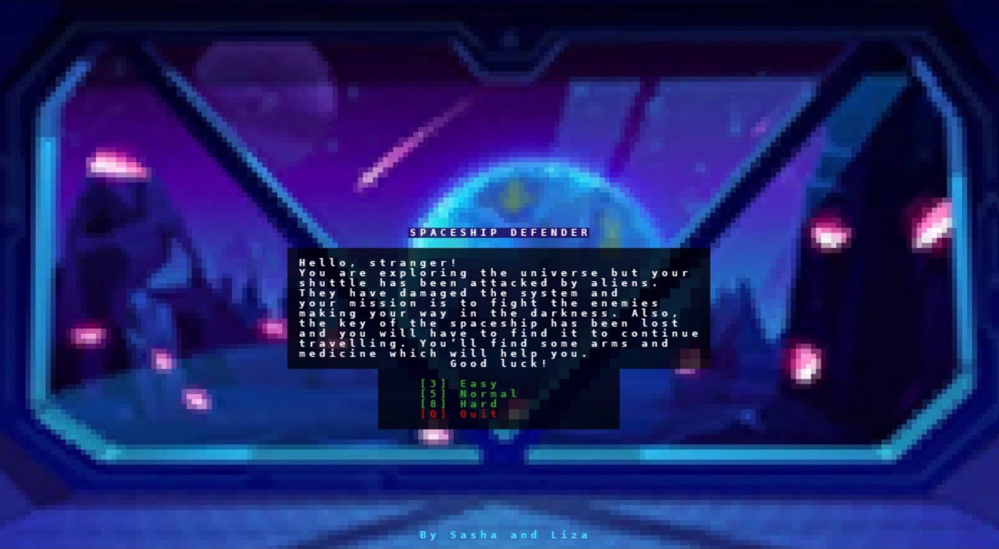

<h1 align="center">SpaceshipDefender</h1>

Игра в жанре Ruguelike написанная в Python 3. Уровни генерируются случайным образом, каждая команда соответствует одному действию и одному ходу, наличие «перманентной смерти».

### О чем наша игра

- Космический корабль был захвачен пришельцами, которые вывели его из строя. Герой пытается спасти экспедицию. 
- В комнатах корабля он может найти: оружие (космические бомбы, патроны), аптечки и ключ для завершения миссии (он находится на последнем этаже).
- Когда игрок находит ключ, он побеждает.

### Как играть
Начать игру можно просто запустив файл Main.py.

При запуске открывается меню, где можно выбрать один из уровней сложности (количество этажей):
- 3 - Легкий
- 5 - Средний
- 8 - Сложный

Чем выше этаж тем больше предметов и монстров можно встретить в комнатах.

Карта не видна изначально, она открывается по ходу исследования этажа. 

Передвижение персонажа возможно при помощи стрелок. Остальное управление можно посмотреть в самой игре, нажав на клавишу Tab.

## Информация о создании проекта
### Кто принимал участие в создании проекта
Авторы проекта - Елизавета Шемшурина и Александра Нужненко.

Проект создан в рамках курса "Программирование и лингвистические данные" ОП ФиКЛ НИУ ВШЭ в 2021 году.

### Кто за что отвечал
В процессе работы каждый этап мы обсуждали совместно, но вот некоторые вещи за которые отвечал конкретный человек:

Лиза:
- генерация карты и этажей 
- уровни сложности
- графический интерфейс
- меню

Саша:
- система инвентаря 
- система сражений
- поле зрения персонажа
- предметы и оружие

### Чем пользовались
- Библиотека TCOD (API для разработчиков roguelike)
- [Здесь](http://rogueliketutorials.com/tutorials/tcod/v2/) находится туториал, который также помог нам при создании этого проекта

